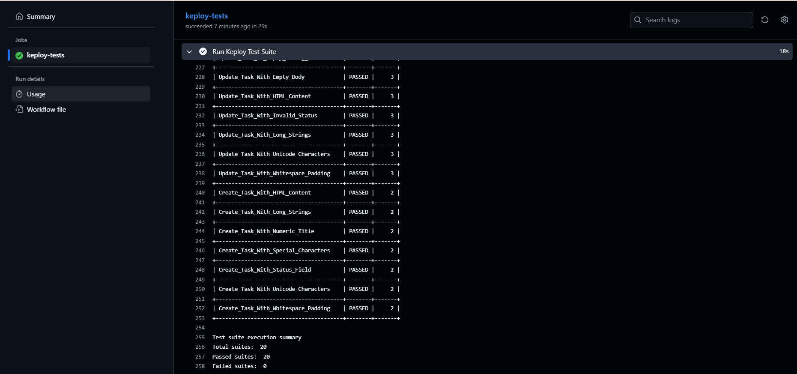

# 📘 Task Manager API 

A full-stack Task Manager app built with **Node.js**, **Express**, and **MongoDB**, featuring a clean, modern frontend with **HTML, Tailwind CSS, and JavaScript**. It allows users to create, view, update (toggle status), and delete tasks. Deployed using **Render**.

---

## 🚀 Live Demo

👉 [Click to view the deployed app](https://taskboard-jy2h.onrender.com/) 

---

## 📌 Features

* ✅ Add new tasks
* ✅ View all tasks
* ✅ Mark tasks as complete/incomplete (toggle)
* ✅ Delete tasks
* ⏰ Real-time date and clock in the UI
* 🎨 Fully responsive and modern Tailwind-based design
* MongoDB integration with Mongoose
- Jest + Supertest-based unit, integration & API tests
- 97%+ test coverage
- Deployment-ready on platforms like Render


---
## 🛠️ Tech Stack

| Layer          | Tool                         |
|----------------|------------------------------|
| Backend        | Node.js, Express             |
| Database       | MongoDB (via Mongoose)       |
| Frontend       | HTML, CSS (TailwindCSS)      |
| Testing        | Jest, Supertest, mongodb-memory-server |
| Deployment     | Render + GitHub              |


## 🧪 API Endpoints

| Method | Endpoint           | Description              |
|--------|--------------------|--------------------------|
| GET    | `/api/tasks`       | Get all tasks            |
| POST   | `/api/tasks`       | Create a new task        |
| PUT    | `/api/tasks/:id`   | Update task by ID        |
| DELETE | `/api/tasks/:id`   | Delete task by ID        |


Base URL: `http://localhost:5000/api/tasks` or Render deployed link

### 1. `GET /api/tasks`

Retrieve all tasks

```bash
curl http://localhost:5000/api/tasks
```

**Response**:

```json
[
  {
    "_id": "...",
    "title": "Buy milk",
    "description": "From the local store",
    "status": "pending",
    "__v": 0
  }
]
```

### 2. `POST /api/tasks`

Create a new task

```bash
curl -X POST http://localhost:5000/api/tasks \
  -H "Content-Type: application/json" \
  -d '{ "title": "Do homework", "description": "Math assignment" }'
```

### 3. `PUT /api/tasks/:id`

Update task status (toggle between pending/completed)

```bash
curl -X PUT http://localhost:5000/api/tasks/<task_id> \
  -H "Content-Type: application/json" \
  -d '{ "status": "completed" }'
```

### 4. `DELETE /api/tasks/:id`

Delete a task

```bash
curl -X DELETE http://localhost:5000/api/tasks/<task_id>
```

---
## 🧰 Testing Frameworks and Tools Used

| Tool                  | Purpose                                          |
|-----------------------|--------------------------------------------------|
| **Jest**              | Unit, integration, and API testing              |
| **Supertest**         | Testing HTTP requests/responses                 |
| **mongodb-memory-server** | In-memory MongoDB instance for safe testing |
| **dotenv**            | Load test environment variables                 |

---

## 📸 Test Coverage Screenshot

✔️ Achieved **~97% test coverage** across all components.


## 📸 Deployed Screenshot

✔️ Achieved **Best UI**across all components.


## 🧪 Keploy API Test Report




## 🗃️ Database Used

* **MongoDB Atlas** (cloud-hosted)
* Integrated using **Mongoose** ODM in `server.js`:

```js
mongoose.connect(process.env.MONGO_URI, {
  useNewUrlParser: true,
  useUnifiedTopology: true,
})
```

Schema:

```js
{
  title: String,
  description: String,
  status: {
    type: String,
    enum: ['pending', 'completed'],
    default: 'pending'
  }
}
```

---

## 📦 How to Run Locally

### Backend (Server)

```bash
git clone https://github.com/vishalsiingh/Task-Manager-API.git
cd Task-Manager-API
npm install
```

Create `.env` file:

```
PORT=5000
MONGO_URI=your_mongodb_atlas_uri_here
```

Start the server:

```bash
npm run dev
```
Test the server:

```bash
npm test
```

The server will run at `http://localhost:5000`

### Frontend (Optional)

The frontend is in the `public/index.html` file.
To preview locally:

1. Start the server (it serves the HTML automatically)
2. Open `http://localhost:5000/` in your browser

---

## 📬 Contact

Created by **Vishal Kashyap** 🧑‍💻
📧 [vishalkashyap165@gmail.com](mailto:singhvishalk165@gmail.com)
🌐 [GitHub: vishalsiingh](https://github.com/vishalsiingh)

---

## 🏷️ Tags

`Node.js` `Express` `MongoDB` `Mongoose` `Tailwind CSS` `JavaScript` `Fullstack` `CRUD` `Render`

---

> ⭐ If you liked this project, give it a star on GitHub!
